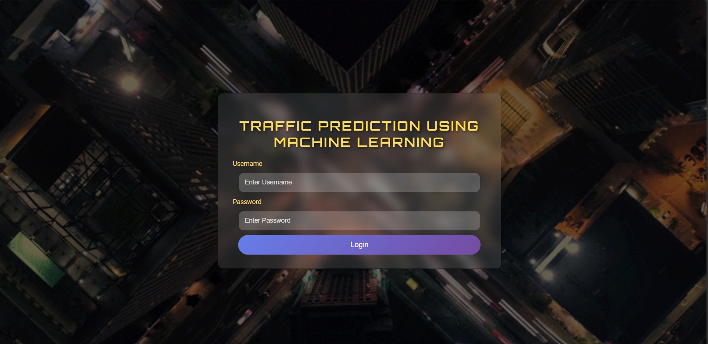
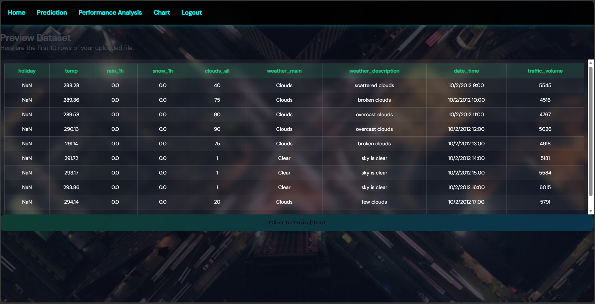
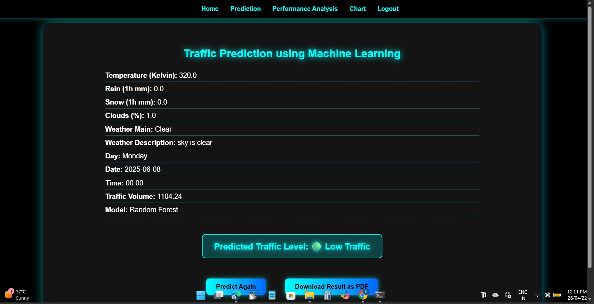
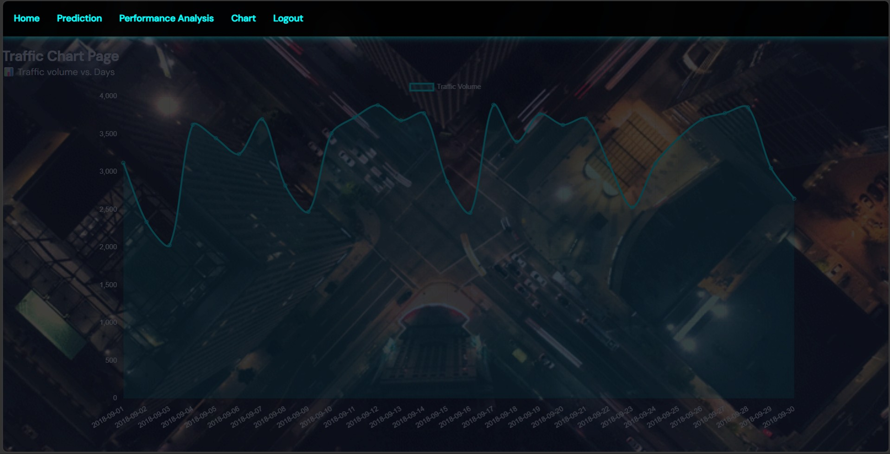

# 🚦 Traffic Prediction System

## 📌 Overview

This project is a Machine Learning-based Traffic Prediction System developed using Flask.
It allows users to upload datasets, train a model, predict traffic volume, and generate reports.

💡 This project demonstrates how machine learning can be integrated with a web application to solve real-world traffic congestion problems.

---

## 🎯 Features

* User Login System
* Upload CSV Dataset
* Train Machine Learning Model
* Predict Traffic Volume
* Performance Analysis (MSE & R² Score)
* Traffic Visualization (Charts)
* PDF Report Generation

---

## ⚙️ Technologies Used

* Python
* Flask
* Pandas
* NumPy
* Scikit-learn
* Joblib
* FPDF

---

## 🤖 Machine Learning Model

* Algorithm: Random Forest Regressor
* Data Preprocessing: Label Encoding
* Evaluation Metrics:

  * Mean Squared Error (MSE)
  * R² Score

---

## ▶️ How to Run

### Using .exe

1. Open the `dist` folder
2. Run `app.exe`
3. Open browser and go to:
   http://127.0.0.1:5000

### Using Python

1. Open terminal in project folder
2. Install required dependencies:
   pip install -r requirements.txt
3. Run the application:
   python app.py
4. Open browser and go to:
   http://127.0.0.1:5000

---

## 📂 Project Structure

* app.py
* templates/
* static/
* datasets/
* models/

---

## ⚠️ Note

* Dataset must be in CSV format
* Train model before prediction

---

## 📸 Screenshots

### 🔐 Login Page

### 🏠 Dashboard

### 📂 Upload Dataset

### 🔮 Prediction Result

### 📈 Traffic Chart

## 👩‍💻 Author

Kajal Sonawane
